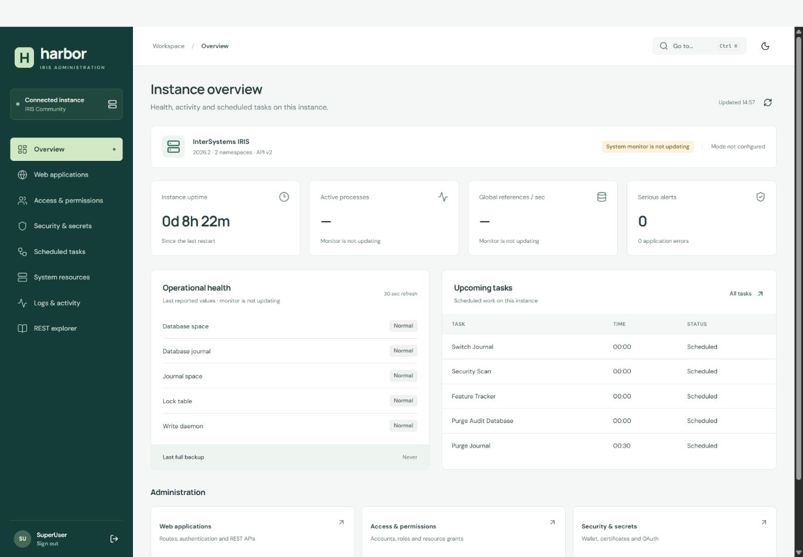

# Harbor for InterSystems IRIS

Harbor brings applications, permissions, secrets, tasks, host resources and logs into one consistent interface. It talks to the real InterSystems SysAdmin v2 APIs. It does not replace IRIS authorization or simulate administrative results.

Built for the [InterSystems Programming Contest: Build Your Own Management Portal](https://community.intersystems.com/post/intersystems-programming-contest-build-your-own-management-portal).



## What you can do

| Workspace            | Capabilities                                                                                                                            |
| -------------------- | --------------------------------------------------------------------------------------------------------------------------------------- |
| Overview             | Live IRIS monitor values, subsystem health, uptime, backup status and upcoming tasks.                                                   |
| Web applications     | Create, inspect, edit and delete applications; configure dispatch classes, namespaces, authentication and access resources.             |
| Access & permissions | Manage users, reset passwords, edit roles and inherited roles, and configure resource grants.                                           |
| Security & secrets   | Manage wallet collections and secrets, X.509 credentials, TLS configurations, OAuth server definitions, clients and client credentials. |
| Scheduled tasks      | Create and edit schedules; run, suspend and resume tasks; inspect authoritative execution state.                                        |
| System resources     | CPU, memory and disk telemetry; process inspection and eligible process controls; device management; database inspection.               |
| Logs & activity      | System messages, alerts, security audit, task history, journal files and session-local portal activity; filtering and exports.          |
| REST explorer        | Search the official request catalog and execute read requests with your current account permissions.                                    |

Every editor has a separate review step. Deletions and execution controls require you to type the target identifier. Editing checks for changes made by another administrator before sending an update. These checks reduce accidental overwrites; they are not a server-side transaction or lock.

Light and dark themes, keyboard navigation, a **Ctrl/Cmd+K** workspace switcher, responsive layouts, loading states, empty states and actionable errors are included. Fonts and icons are bundled locally.

## Quick start: complete local installation

Requirements: Docker Engine/Desktop with Compose v2, at least 4 GB available RAM, and approximately 5 GB free disk space. Linux containers are required. On Windows, start Docker Desktop or a Docker daemon in WSL first.

```sh
docker compose up -d --build
```

Open **http://localhost:3100** and sign in:

- Username: `SuperUser`
- Password: `HarborLocal-2026!`

This is a known **local demonstration credential**, configured only by the bundled IRIS development image. Both published ports bind to `127.0.0.1`. Do not expose this stack to the public internet. Use your own instance and account for deployment.

The first image build takes several minutes. It installs the small ObjectScript/Embedded Python extension and pins the IRIS Community image by digest. The portal uses a non-root Node.js container. The `iris-data` volume preserves the IRIS manager databases across container replacement.

```sh
docker compose ps
docker compose logs --tail=80 portal iris
docker compose down          # keeps IRIS data
```

If ports are in use, configure `HARBOR_PORT`, `HARBOR_ORIGIN` and `IRIS_WEB_PORT` together. Example in Bash:

```sh
HARBOR_PORT=3101 HARBOR_ORIGIN=http://localhost:3101 IRIS_WEB_PORT=52775 docker compose up -d --build
```

In PowerShell, set the corresponding `$env:HARBOR_PORT`, `$env:HARBOR_ORIGIN` and `$env:IRIS_WEB_PORT` variables before running Compose. Use the exact configured browser origin; `localhost` and `127.0.0.1` are different origins.

## Connect to an existing IRIS instance

Use IRIS Community **2026.2 with SysAdmin API v2**, or a compatible newer instance. The bundled stack pins 2026.2 build 221U. IRIS for Health exposes the same management APIs, but the included automated live checks were run on standard IRIS Community; a separate IRIS for Health installation has not been certified here.

1. Enable `/api/admin` with password authentication on your IRIS instance. Keep normal IRIS security resource checks in place.
2. Install the extension in `%SYS`. Copy `iris/Harbor` to your server, then run:

   ```objectscript
   zn "%SYS"
   do $SYSTEM.OBJ.LoadDir("/path/to/iris/Harbor","ck",,1)
   do $SYSTEM.Status.DisplayError(##class(Harbor.Installer).Install())
   ```

   The installer creates `/api/harbor` with password authentication and `%Admin_Operate` protection. It does **not** change existing account passwords. `iris/configure.script` is only for the disposable Docker demonstration image; never run it on an existing environment.

3. Install Node.js 22 LTS or newer and configure the portal:

   ```sh
   npm ci
   cp .env.example .env
   # Set IRIS_URL to your existing instance and PUBLIC_ORIGIN to your browser URL.
   npm run dev
   ```

4. Open **http://localhost:5173** and use your IRIS credentials. You need the relevant `%Admin_*:USE` privileges for each operation. Errors from insufficient privileges are displayed, not bypassed.

For a production build:

```sh
npm run build
# Set PUBLIC_ORIGIN=http://localhost:3100 for this local production server.
npm start
```

See [deployment and security](docs/DEPLOYMENT.md) before serving to other users.

## A five-minute walkthrough

1. Sign in and inspect **Overview**. The system-monitor indicator explains when IRIS statistics are not updating. Values are never replaced with sample numbers.
2. Open **Web applications**, search for a route and open its details. Choose **Edit**, change a description, then review the old and new values before applying.
3. In **Access & permissions → Roles**, inspect a role's resource grants and inherited roles. New grants use explicit resource names and `R`, `W`, `U` permission combinations.
4. In **Security & secrets**, create a wallet collection. Select it in **Wallet secrets** and create a `collection.name` secret. Secret values are write-only; the list shows metadata. Use the `WalletSecretConfig` help text to supply the documented IRIS configuration for the selected secret type.
5. In **Scheduled tasks**, open a task to see its execution status from `/task/info`. Create an on-demand `Harbor.DemoTask` in `%SYS` to try a harmless run: it only records the last-run timestamp in `^HarborDemo`. A requested run is not proof that arbitrary task code succeeded; inspect **Logs → Task history**.
6. In **System resources**, wait for two telemetry samples to see CPU utilization, then inspect a process. The UI honors IRIS capability flags for suspension and termination.
7. Open **Logs & activity**, switch between original sources, filter entries and export a source if needed. Security audit queries run asynchronously and are polled until completion.
8. Use **REST explorer** for less common read requests. Required query parameters are taken from the pinned API contract.

## Development and verification

```sh
npm ci
npm run check                 # TypeScript, browser/server builds, security and contract tests
npm audit                    # dependency audit
```

Live tests create **temporary administrative records** and clean them up. Only run against a disposable instance:

```sh
export IRIS_TEST_USER=SuperUser
export IRIS_TEST_PASSWORD='HarborLocal-2026!'
npm run test:live
npm run test:workflows
```

For PowerShell, use `$env:IRIS_TEST_USER='SuperUser'` and `$env:IRIS_TEST_PASSWORD='HarborLocal-2026!'`.

The live suites verify create/update/read/delete behavior, account disablement, wallet metadata isolation, task scheduling and execution controls, OAuth configuration and asynchronous audit retrieval. Read [the verification record](docs/VERIFICATION.md) for exact coverage and known platform differences.

## Architecture

```text
Browser (React + TypeScript)
        │ same-origin JSON + HttpOnly session cookie + CSRF token
Node.js gateway (Express)
        │ fixed IRIS upstream; user's credentials held in memory
        ├── /api/admin → native SysAdmin v2 APIs
        └── /api/harbor → protected ObjectScript + Embedded Python extension
```

- `src/pages`: task-oriented application screens.
- `src/components`: accessible tables, dialogs and schema-backed editors.
- `shared/catalog.ts`: the human-facing resource catalog; `shared/schema.ts`: request-schema access.
- `shared/iris-openapi.json`: unchanged upstream specification; `iris-contract.json`: generated request-only projection.
- `server`: sessions, origin/CSRF protection, allowlisted upstream requests and response handling.
- `iris/Harbor`: native extension, installer and harmless demo task.
- `tests`: security boundaries and contract checks; `scripts`: reproducible live checks.

There is no background AI service, analytics, paid API, cloud account requirement or simulated backend. See [architecture](docs/ARCHITECTURE.md) and [contest coverage](docs/CONTEST.md).

## License and attribution

Original application code is MIT licensed. The InterSystems API specification is attributed separately in [THIRD_PARTY.md](THIRD_PARTY.md). InterSystems IRIS is a separately licensed product and is not covered by this repository's MIT license.
