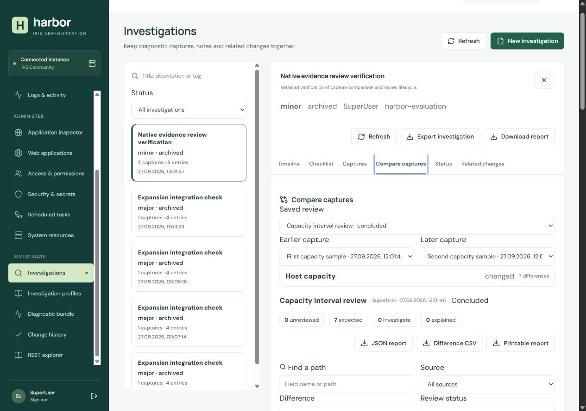

# Operational workflows

Harbor uses the signed-in account's native IRIS privileges. Saved operational records belong to that account and a stable instance identity. They are not shared team records. Reopening a case or receipt checks current native access; a saved capture does not preserve revoked privileges.

Linked change receipts are also part of a case's access requirements. Adding a link checks current access to its source, and later case reads and listings repeat that check. Losing access to any linked source hides the case until access is restored. Preserve linked receipts together with their cases during retention and recovery: a missing or unreadable receipt blocks access rather than exposing copied timeline metadata without its source check.

Investigation reads validate the structure of saved notes, checklists, reviews and capture metadata before returning a detail or accepting an edit. A malformed record is listed as unreadable while healthy cases remain accessible. Preserve the original file for inspection; Harbor does not repair it, drop invalid entries or rewrite it during a read or refused edit. Native capture payloads and unknown metadata remain unchanged. These checks establish readable structure, not the authenticity of historical evidence or protection against someone with write access to the data directory.

Signing in, signing out or receiving a current session rejection clears protected views in other open Harbor tabs on the same origin through `BroadcastChannel`. Those tabs return to sign-in; they do not silently adopt another user's identity. Responses and automatic polling or change continuations from the old session cannot populate the new session. The notification contains no identity, credentials or operational data.

If the browser does not support or allow `BroadcastChannel`, session handling still works in the current tab, but automatic clearing of other tabs is unavailable. Close or reload other Harbor tabs when changing accounts in that browser. Previously downloaded exports cannot be recalled.

A sign-in that starts while another account session is active cannot replace that session if it is signed out, replaced or expires before credential verification finishes. Harbor rejects that delayed sign-in without issuing a new cookie; submit the sign-in again explicitly. An already-expired cookie at the start does not prevent a fresh sign-in. This check does not cancel native work already dispatched, and independent sign-ins that start without an active session are not ordered by this replacement check.

An ordinary native GET sent through `/api/iris` cancels its HTTP transport if the browser connection closes before the response finishes. The 20-second upstream deadline and 8 MB streamed-response limit still apply. Transport cancellation does not guarantee that IRIS has stopped work already started. This ownership rule does not apply to diagnostic batches, other observation routes, POST audit operations or durable change execution/readback; those keep their existing completion handling. Do not treat disconnecting as cancellation of a native change.

## Investigate a change

Creating an investigation or profile does not automatically retry after a lost or unreadable response. If creation cannot be confirmed, the form keeps its draft and asks you to check the saved list before creating again: the first request may already have succeeded. Known validation or permission errors retain their specific explanation. A newly failed submission focuses and reveals its error inside the form; editing the retained draft does not move focus again. You can deliberately create another record, but a second submission is a new creation, not a recovery of the first request.

Starting an investigation from a profile opens the returned investigation directly. A transient failure to refresh the list does not discard its known ID or detail. The handoff is consumed once and belongs to the current sign-in; navigating back or signing in again cannot restore it. A subsequent access denial still clears the protected detail.

1. Open **Investigations → New investigation**. Give the case a concrete question, severity and optional tags.
2. In **Captures**, select the relevant fixed sources and record a title such as “Before schedule update”. Each source is read independently. A failed source remains explicitly unavailable beside successful evidence.
3. Carry out any necessary administrative change using its normal editor. The separate review shows the exact target and fields. **Change history** retains its receipt.
4. Capture the same sources again. Select the earlier and later captures in **Compare captures**. Source cards distinguish changed, unchanged, unavailable and limited comparisons.
5. Filter differences by source, change type, path or review status. Search includes value previews only when selected. Values distinguish missing, null, empty string and type changes. Numeric differences are arithmetic deltas, not rates or causal findings.
6. Start an evidence review for the selected pair. Record an expected, investigate or explained decision with reasoning. Revisions retain earlier decisions in the review history. A conclusion requires all retained differences to be expected or explained and explicit acknowledgement of evidence limits.
7. Link the administrative change ID in **Related changes**, add any remaining notes and resolve the case. A required checklist item must be completed or explicitly marked not applicable. Resolve before archiving; reopen an archived case before adding evidence.

Captures are immutable. Changing a decision does not change the underlying observations. A review conclusion is the analyst's assessment, not a machine-issued declaration that the instance is healthy. A reopened review retains its previous conclusion in the case timeline.

The same review is available in the [mobile layout](images/evidence-review-mobile.png). The [verification record](VERIFICATION.md) describes the native and browser checks behind these screenshots.

The comparison matches only recognized root inventory identities: native task IDs, journal filenames, and process generations when supplied. Unknown arrays and nested configuration preserve order. A process ID alone is insufficient to identify a process across two captures. Logs and history are bounded windows; entries disappearing between windows do not establish deletion from the underlying source.

Exports include a complete bounded case JSON, a printable case report, and per-comparison JSON, HTML and CSV. The CSV contains retained differences and current decisions; unavailable-source details and comparison limits are in JSON/HTML. Value previews in comparison exports can be clipped. Retained full payloads are available in the case captures. Operational free text may contain sensitive information: inspect it before sharing.

## Reuse an investigation profile

**Investigation profiles** stores a title, description, fixed source selection and checklist. Start from a built-in definition or write your own. Import accepts only the documented profile data; no commands, file paths or arbitrary endpoints are executed.

Profile files are limited to 300,000 bytes before reading. This bound includes the largest supported text fields after UTF-8 encoding, JSON escaping and export formatting. The imported definition must also fit the gateway's unchanged 256 KiB JSON request limit when compactly encoded for creation; an unsendable definition is rejected with a request-size explanation. Imports do not save automatically. Beginning another editor workflow or closing its dialog discards an older pending file result, including its errors, so it cannot change the newer draft or its revision target.

Each edit creates a new profile revision with a reason. Starting an investigation copies the chosen revision and gives its checklist independent item identities. Updating or archiving the profile cannot rewrite an existing case. Checklist decisions require a note and retain the deciding account and timestamp.

## Verify administrative changes

Harbor prepares changes before sending them. A durable record is saved before dispatch; duplicate dispatches are refused. The gateway serializes its own writes to the same canonical target. This is not a lock held inside IRIS, so another native administrator can still act between the read and write.

If the browser loses an execution response, the request may already have reached IRIS. Preserve the record ID shown in the error and use **Read change record** or **Change history → Refresh record** before continuing. This lookup reads the journal and does not execute the operation again. “Awaiting confirmation” in Change history describes the browser's stale view, not a new server receipt state. A failed lookup keeps the execution controls blocked. Editor retains its draft with Back, but continuation after an execution error takes place in Change history; it does not prepare another ticket from that same editor. A received successful result remains visible even if refreshing the surrounding list fails.

Inspect the receipt state:

| State              | Meaning and next action                                                                                                                |
| ------------------ | -------------------------------------------------------------------------------------------------------------------------------------- |
| Prepared           | Review exists; it has not dispatched. Execute only after checking its exact target and fields.                                         |
| Verified           | The relevant observable result matched the expected outcome on readback. This is not a full functional test of an application or task. |
| Acknowledged       | IRIS accepted the operation but its write-only value or effect cannot be proved through equality.                                      |
| Uncertain          | The response or readback did not establish the outcome. Inspect and reconcile by reading current state; do not blindly resubmit.       |
| Rejected/cancelled | Inspect the explanation. The receipt retains the reason and observations.                                                              |

Write-only credentials remain in gateway memory only while the prepared review is valid. They are absent from saved receipts. Restarting the gateway invalidates an unexecuted preparation that needs those credentials. Prepare it again after checking its status; do not treat an old receipt as replayable.

Process actions require native generation identity and capabilities. The active administrator and management routes have additional protection against accidental loss of access. Impact findings are advisory references, not a complete effective-permission proof.

## Inspect runtime, tasks and application dependencies

**Runtime workbench** keeps a bounded browser session of timestamped samples. Configure thresholds for the observed metrics and compare samples with their intervals. Missing metrics remain unknown. Linux host counters do not establish container quotas, and monitor data can be stale. No background alert delivery or automatic repair is implied.

**Task center** joins the native task definition, execution state and a bounded history window. Unknown outcomes remain unknown; duration statistics use only valid timestamp pairs. Native schedule fields are explained without inventing future occurrences. Configuration comparison uses a browser-held baseline and does not modify a task.

See the [task center desktop view](images/task-center-desktop.png) and [mobile view](images/task-center-mobile.png).

**Application inspector** joins native application configuration, namespace, entry resource and default databases. Authentication flags, CORS origins, cookie settings and route relationships identify review points. Actual externally reachable routing depends on your Web Gateway/proxy and application code. The inspector does not fetch arbitrary URLs or certify external accessibility.

## Navigate log files

**Log files** reads only the server's allowed messages/alerts files. A page contains at most 256 KiB and 500 lines. An older-page cursor is signed and tied to the account, instance and file identity. Rotation or truncation invalidates an incompatible cursor instead of silently stitching unrelated files. Refresh from the newest window after such a notice. This is a log viewer, not a full retention or search service.

## Storage and recovery

The gateway stores records below `HARBOR_DATA_DIR`; Compose mounts a dedicated named volume. Keep `IRIS_INSTANCE_ID` stable. Changing it intentionally opens a different record partition. The store uses atomic replacement and optimistic revisions for a **single gateway writer**; do not mount the same data directory into concurrent replicas.

| Bound                                  | Current value                                      |
| -------------------------------------- | -------------------------------------------------- |
| Stored record                          | 4,000,000 UTF-8 bytes                              |
| Collection, per account/instance       | 500 records                                        |
| Case timeline                          | 200 entries                                        |
| Case captures                          | 12                                                 |
| Source payload in each capture         | 200,000 UTF-8 bytes                                |
| Linked changes per case                | 30                                                 |
| Evidence reviews per case              | 20                                                 |
| Retained differences per source        | 200                                                |
| Examined comparison nodes per source   | 12,000                                             |
| Comparison depth / value preview       | 14 levels / 1,600 characters                       |
| Decision revisions per evidence review | 2,000, also subject to the total record byte limit |

When a bound is reached, export and continue in a follow-up investigation. Archive retains data and does not free collection capacity. There is no automatic purge. Stop the gateway and back up its data volume before operator-controlled retention or recovery. Do not manually edit a live record to bypass a conflict or limit. Unreadable records are reported; preserve them before investigating disk or migration problems.

Change receipts reserve space for their outcome before sending a native write. A prepared receipt whose preserved contents leave insufficient room is rejected without dispatch. After execution or reconciliation, an oversized new native response, full readback or set of observed field values may be omitted to keep the receipt and its bounded outcome/history metadata within the existing file limit. Field comparisons run on the complete fresh readback before this decision; omission does not turn a mismatch into verification. The receipt retains the native status, comparison results, requested fields and baseline. `evidenceOmissions` identifies each omitted segment, its encoded byte size and time, and whether earlier saved values remain. Change history warns beside the outcome and raw evidence panel; its field table never labels an earlier retained value as the current readback. JSON exports include the same notices. A later small successful read can replace the omission with current evidence. Omission never replays a native write or deletes earlier saved evidence to make space.

The capacity projection includes all potentially readable field comparisons, the existing 80-event bound with the longest fixed outcome/reconciliation narrative, three omission notices and the existing 2,000-character native job/query identifier bounds. New raw evidence cannot consume that projected room. This is a bounded receipt policy, not a guarantee against disk failures or unlimited record growth. Previously stored records already near the limit may still lack room for further metadata; preserve them and inspect the native result independently rather than retrying a write. Existing history bounds and retention rules are unchanged.

The IRIS data volume needs an IRIS-supported backup procedure. A gateway-data backup is not an IRIS database backup. Saved cases and change receipts are useful operational history, but are neither cryptographically immutable nor a replacement for native IRIS security audit.

The final production-client browser check used an isolated memory-only fixture: desktop1280×900 and phone390×844 showed the created investigation after profile-start201 despite list500. List403 removed detail/export; leaving and returning did not restore the consumed handoff. A dropped creation response and unreadable201 preserved drafts and prompted checking saved records; subsequent list reads recovered the created records without recreating them. Exact400 refusals retained their original text. Repeated profile refusals refocused the message, while typing retained input focus. Browser inspection found that nearest-edge scrolling hid the alert behind the sticky modal heading; centered scrolling corrected it. Final profile alerts were fully visible at165–255desktop and148–298phone. The start form failure focus is covered by callback tests; its successful handoff was exercised in the browser. No native connections or writes were made. Evidence: workspace research/harbor-create-browser-state.json, harbor-create-browser-counters.json, and harbor-created-detail/harbor-create-uncertain/harbor-profile-uncertain screenshots. Full build and305 tests passed after the centered-scroll correction.
